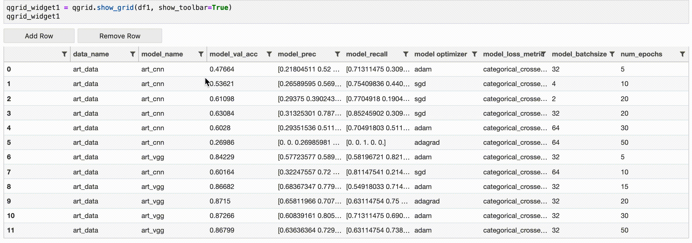
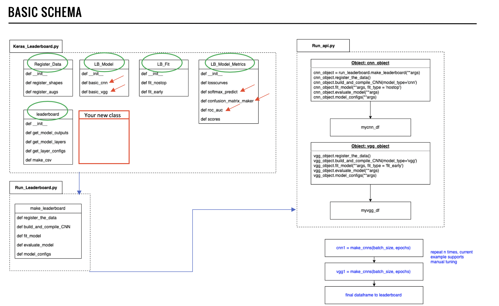

# keras_leaderboard
Prototype API to track models and output metadata using the Keras API

Contributors:
- Catherine Ordun
- Michael Fagundo
- Josh Luxton
- Chao Wu

<b>Download Data</b> Kaggle art dataset: https://www.kaggle.com/thedownhill/art-images-drawings-painting-sculpture-engraving

<b>Install Quantopian Widget</b>: https://github.com/quantopian/qgrid 

<b>Set up your Virtual Environment on your GPU</b>

    $ conda create -n leaderboard_env python=3.6
    $ source activate leaderboard_env
    $ mkdir leaderboard_dir

<b>Install requirements into `leaderboard_env`:</b>

    $ pip install -r requirements.txt
    
<b>Upload data into `data` directory as a sub-directory of `keras_leaderboard`</b>

<b>Run main.py</b>

    $ python main.py

Model outputs will be aggregated into the directory, *test*:
- Within *test*, there will be a series of directories with the format "model_name_month_day_hour_minute" of when the model was created
    - Within these directories there will be folders containing csv's, plots and other files
        
Additionally, a CSV with metadata outputted for each model. 

You can also run the `Example.ipynb` that will use the Quantopian Widget.

Run all cells in the notebook. This will generate an interactive widget. 
 
<b>Pull requests welcome for:</b>

- Model configs including `model_outputs`, `model_layers`, `model_configs` are outputted to separate csv files but cannot fit in the final leaderboard, plus they're very ugly `dict` files. We need a better way to display, possible use GraphViz to draw out the configs in a tree-like structure: https://www.graphviz.org/
- In `keras_leaderboard.py/def get_model_outputs(self)` I added an error message `Something went wrong, here's an empty dataframe` because the VGG model layers in Keras only show the aggregated generic "VGG layer" not all the layers of VGG16, so for some reason it doesn't output to a dataframe nicely (I forgot how I troubleshooted it). Need to update this by asking Keras to return all layers in VGG16. 
- Update the schema by introducing new classes

<b>Ideas for improvement:</b>

- Expand scope of models beyond ‘basic_cnn’ and ‘basic_vgg’
- Expand API to tune full range of hyperparameters for each model
- Add automated hyperparameter tuning 
- Create a front-end in Plotly, create a back-end basic as SQL
- Select highest accuracy models based on acc, prec, recall and automate to deployment environment
- Replicate in PyTorch!

  

